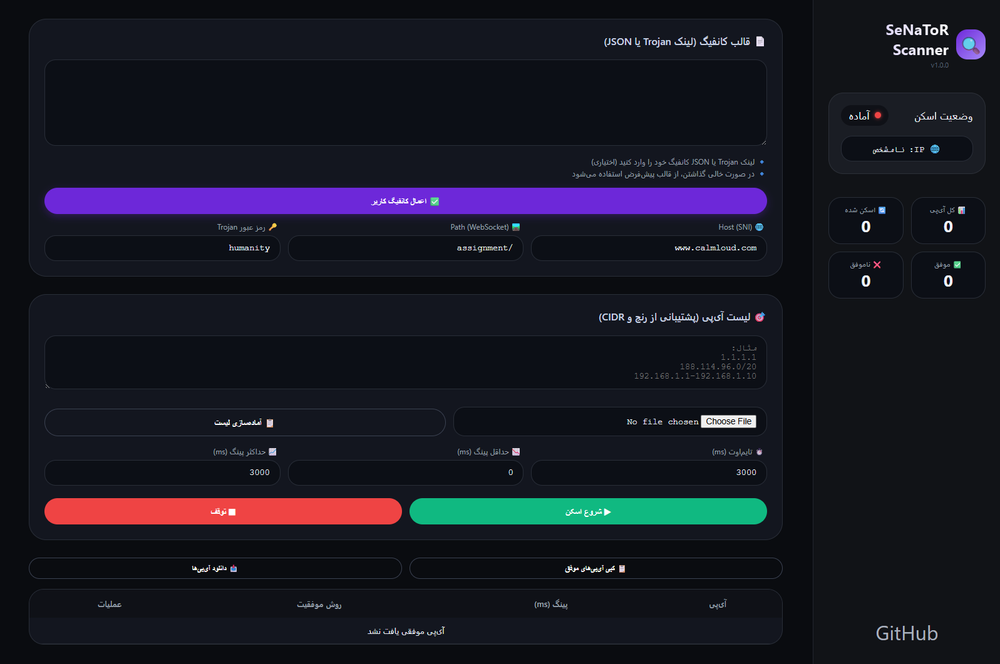

# 🔍 SeNaToR Scanner

**Trojan Scanner** with false-positive detection, automatic Trojan link to JSON conversion, and a modern sidebar UI inspired by Se7en Pro.

## ✨ Features

- ✅ **False-Positive scanning** – any server response (open/error/close) counts as success.
- 🔄 **Trojan link to JSON** – paste a `trojan://...` link and convert it to a full V2Ray JSON config.
- 🎯 **Customizable Host/Path/Password** – test with your specific Trojan WebSocket settings.
- 📂 **Bulk IP input** – supports single IPs, ranges (e.g., `192.168.1.1-192.168.1.10`), and CIDR (e.g., `188.114.96.0/20`).
- 📊 **Live statistics** – total IPs, scanned, success, fail counts.
- 🌐 **User IP display** – shows your real public IP.
- 💾 **Export results** – copy/download list of working IPs.
- 🔗 **Per‑IP outputs** – generate Trojan link or full JSON config for each successful IP.
- 🧩 **Built‑in fragment obfuscation** – ready‑to‑use outbound with `fragment` for TLS hello splitting.

## 🖥️ How to Use

1. **Open** `index.html` in any modern browser (Chrome, Firefox, Edge).
2. **Paste your template** – either a Trojan link (starts with `trojan://`) or a custom V2Ray JSON config (with placeholders `IP_PLACEHOLDER`, `HOST_PLACEHOLDER`, `PATH_PLACEHOLDER`, `PASS_PLACEHOLDER`).
3. **Click “اعمال کانفیگ کاربر”** – the tool will convert/validate and store your config.
4. **Enter IP addresses** (one per line, supports ranges and CIDR).
5. **Adjust scan settings** – timeout (ms), min/max ping filter.
6. **Start scan** – the scanner will test each IP on port 443 with your Host/Path (WebSocket false‑positive mode).
7. **For each working IP**, click **“لینک Trojan”** to copy a ready‑to‑use Trojan link, or **“JSON”** to copy the full V2Ray configuration (remark `SeNaToR`).
8. **Export** all working IPs via the copy/download buttons.

## 🛠️ Default Configuration

- Host: `www.calmloud.com`
- Path: `/assignment`
- Password: `humanity`
- Remark in output JSON: `SeNaToR`

You can override these fields manually before scanning.

## 📦 Technologies

- Pure HTML5 / CSS3 / JavaScript (ES6)
- No external dependencies
- WebSocket & Image‑based testing
- Responsive design (works on mobile)

## 🤝 Contributing

Feel free to open an issue or pull request on [GitHub](https://github.com/jalal-asiaiy/SeNaToR-Scanner).

## 📄 License

[MIT](LICENSE)

## 👤 Author

**Jalal Asiaiy** – [GitHub](https://github.com/jalal-asiaiy)
